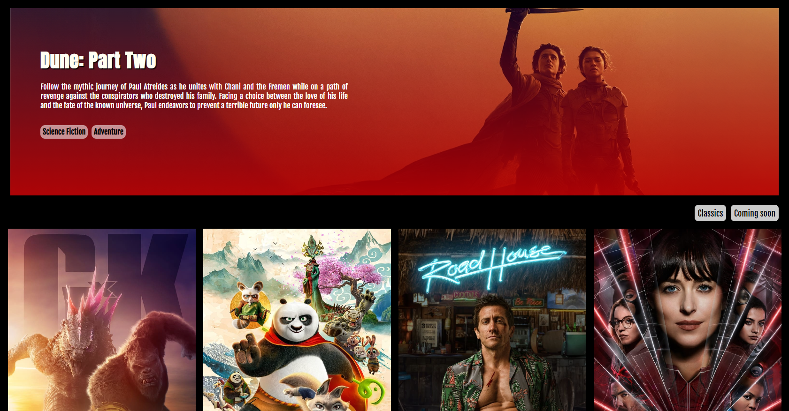

<h1 align="center">
  
</h1>

# Movie Site Project

Creating a engaging webpage, by fetching differents APIs from themoviedb.org, where the user can see recent movies as well as providing other movies selection filters.

### The Problem

Describe how you approached to problem, and what tools and techniques you used to solve it. How did you plan? What technologies did you use? If you had more time, what would be next?

One problem we faced, was not knowing how to navigate back from specific movie page to the previous page instead of the home page; we solved it by adding "-1" to the useNavigate function. 
We started using the given desing, breaking down the components we needed to use, after that we added some desing elements of our own and went from some Streach goals.   

If we had more time, we will add a "show more" function/button to display more movies. 

### View it live

https://cinema-movielist.netlify.app/